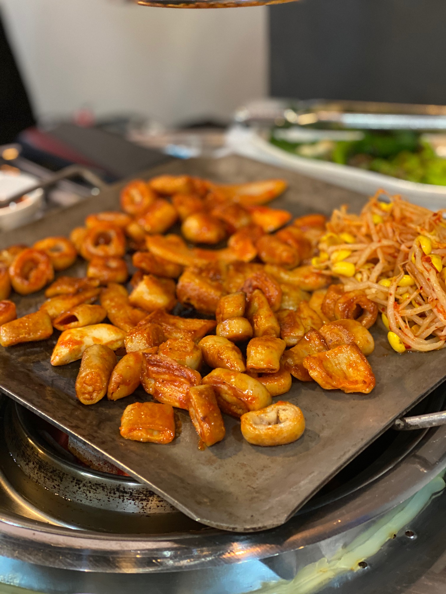

# 2020/08/13 곱창
오늘은 명탐정 희난, 달려라 주니와 함께 곱창을 먹으러갔다.

## 곱창과 막창과 대창 구분할 줄 알아?

우리는 양념 곱창 3인분을 주문했다. 우리는 곱창을 기다리면서 곱창과 막창, 그리고 대창의 차이점에 대한 이야기를 나누었다.

* 대창은 원기둥처럼 생긴 기름진거...
* 막창은 똥글납작한거... 
* 곱창은?

새로운 경험엔 언제나 모험이 뒤따르는 법! 우리의 맛집 레이드는 계속 될 것이다.